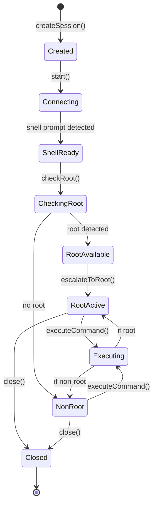

# Persistent ADB Shell Session Design Document
## Android Device Manager for macOS

### 1. Problem Statement

**Current Issues:**
- Every shell command creates a new `adb shell` process
- Each root operation triggers "root access granted" notification on device
- High process creation overhead
- No state persistence between commands
- Poor user experience with constant notifications

**Example of Current Flow:**
```bash
# Current approach - each command is isolated
adb shell su -c "ls /data/local/tmp"  # Root notification #1
adb shell su -c "chmod 755 file"       # Root notification #2
adb shell su -c "cat /proc/version"    # Root notification #3
```

### 2. Proposed Solution

Implement a persistent shell session manager that:
1. Maintains long-running `adb shell` processes per device
2. Automatically escalates to root when available/needed
3. Reuses existing sessions for commands
4. Gracefully handles non-root devices
5. Manages session lifecycle

### 3. Architecture Design

#### 3.1 Core Components

```
┌─────────────────────────────────────────────────────────┐
│                    ShellSessionManager                   │
├─────────────────────────────────────────────────────────┤
│ - sessions: [DeviceID: ShellSession]                    │
│ - createSession(device: Device) -> ShellSession         │
│ - getSession(deviceId: String) -> ShellSession?         │
│ - executeCommand(deviceId: String, cmd: String) -> Result│
│ - closeSession(deviceId: String)                        │
│ - closeAllSessions()                                    │
└─────────────────────────────────────────────────────────┘
                              │
                              ▼
┌─────────────────────────────────────────────────────────┐
│                      ShellSession                        │
├─────────────────────────────────────────────────────────┤
│ - deviceId: String                                      │
│ - process: Process                                      │
│ - inputPipe: Pipe                                       │
│ - outputPipe: Pipe                                      │
│ - isRoot: Bool                                          │
│ - isAlive: Bool                                         │
│ - commandQueue: DispatchQueue                           │
│ - outputBuffer: String                                  │
│ - executeCommand(cmd: String) -> CommandResult          │
│ - checkRoot() -> Bool                                   │
│ - escalateToRoot() -> Bool                             │
└─────────────────────────────────────────────────────────┘
```

#### 3.2 Session Lifecycle



### 4. Implementation Details

#### 4.1 ShellSession Class

```swift
class ShellSession {
    private let deviceId: String
    private var process: Process?
    private var inputPipe: Pipe?
    private var outputPipe: Pipe?
    private var errorPipe: Pipe?
    
    private var isRoot = false
    private var isAlive = false
    private let commandQueue = DispatchQueue(label: "shellSession.\(UUID())")
    private var outputBuffer = ""
    private var commandCompletion: ((String) -> Void)?
    
    // Prompt patterns
    private let shellPrompt = "shell@"
    private let rootPrompt = "root@"
    private let suPrompt = "#"
    
    init(deviceId: String) {
        self.deviceId = deviceId
    }
    
    func start() throws {
        process = Process()
        process?.executableURL = URL(fileURLWithPath: adbPath)
        process?.arguments = ["-s", deviceId, "shell"]
        
        inputPipe = Pipe()
        outputPipe = Pipe()
        errorPipe = Pipe()
        
        process?.standardInput = inputPipe
        process?.standardOutput = outputPipe
        process?.standardError = errorPipe
        
        // Setup output monitoring
        outputPipe?.fileHandleForReading.readabilityHandler = { [weak self] handle in
            let data = handle.availableData
            if let output = String(data: data, encoding: .utf8) {
                self?.handleOutput(output)
            }
        }
        
        try process?.run()
        isAlive = true
        
        // Wait for initial prompt
        Thread.sleep(forTimeInterval: 0.5)
        
        // Check and escalate to root if available
        checkAndEscalateRoot()
    }
    
    private func checkAndEscalateRoot() {
        // First check if we can get root
        if executeRawCommand("su -c 'id'").contains("uid=0") {
            // We can get root, escalate
            _ = executeRawCommand("su")
            isRoot = true
        }
    }
    
    func executeCommand(_ command: String) -> CommandResult {
        guard isAlive else {
            return CommandResult(output: "", error: "Session not alive", exitCode: -1)
        }
        
        return commandQueue.sync {
            return executeRawCommand(command)
        }
    }
    
    private func executeRawCommand(_ command: String) -> String {
        outputBuffer = ""
        
        // Send command
        if let data = "\(command)\n".data(using: .utf8) {
            inputPipe?.fileHandleForWriting.write(data)
        }
        
        // Wait for output with timeout
        let timeout = Date().addingTimeInterval(5.0)
        while Date() < timeout {
            if outputBuffer.contains(shellPrompt) || 
               outputBuffer.contains(rootPrompt) || 
               outputBuffer.contains(suPrompt) {
                break
            }
            Thread.sleep(forTimeInterval: 0.1)
        }
        
        // Clean output (remove prompts and command echo)
        return cleanOutput(outputBuffer, command: command)
    }
}
```

#### 4.2 ShellSessionManager Class

```swift
class ShellSessionManager {
    static let shared = ShellSessionManager()
    private var sessions: [String: ShellSession] = [:]
    private let sessionQueue = DispatchQueue(label: "shellSessionManager", attributes: .concurrent)
    
    func getOrCreateSession(for device: Device) -> ShellSession {
        return sessionQueue.sync(flags: .barrier) {
            if let existing = sessions[device.deviceId], existing.isAlive {
                return existing
            }
            
            let session = ShellSession(deviceId: device.deviceId)
            do {
                try session.start()
                sessions[device.deviceId] = session
            } catch {
                print("Failed to start shell session: \(error)")
            }
            return session
        }
    }
    
    func executeCommand(deviceId: String, command: String, requiresRoot: Bool = false) -> CommandResult {
        guard let session = getSession(deviceId: deviceId) else {
            // Fallback to regular adb shell
            return ADBClient().shell(command: command, deviceId: deviceId)
        }
        
        if requiresRoot && !session.isRoot {
            return CommandResult(output: "", error: "Root access required but not available", exitCode: 1)
        }
        
        return session.executeCommand(command)
    }
    
    func closeSession(deviceId: String) {
        sessionQueue.sync(flags: .barrier) {
            sessions[deviceId]?.close()
            sessions.removeValue(forKey: deviceId)
        }
    }
    
    func closeAllSessions() {
        sessionQueue.sync(flags: .barrier) {
            sessions.values.forEach { $0.close() }
            sessions.removeAll()
        }
    }
}
```

### 5. Integration Points

#### 5.1 Modified ADBClient

```swift
extension ADBClient {
    func shell(command: String, deviceId: String, persistent: Bool = false) -> CommandResult {
        if persistent {
            // Use persistent session
            return ShellSessionManager.shared.executeCommand(
                deviceId: deviceId, 
                command: command
            )
        } else {
            // Use traditional one-shot execution
            return executeCommand(args: ["-s", deviceId, "shell", command])
        }
    }
    
    func shellAsRoot(command: String, deviceId: String) -> CommandResult {
        // Always use persistent session for root commands
        return ShellSessionManager.shared.executeCommand(
            deviceId: deviceId, 
            command: command,
            requiresRoot: true
        )
    }
}
```

#### 5.2 Usage Examples

```swift
// FridaServerManager - Before
func startFridaServer(_ server: FridaServer, device: Device) {
    let result = adbClient.shell(
        command: "su -c 'chmod 755 /data/local/tmp/\(server.name) && /data/local/tmp/\(server.name) &'",
        deviceId: device.deviceId
    )
}

// FridaServerManager - After
func startFridaServer(_ server: FridaServer, device: Device) {
    // First command establishes root session, subsequent commands reuse it
    adbClient.shellAsRoot(
        command: "chmod 755 /data/local/tmp/\(server.name)",
        deviceId: device.deviceId
    )
    adbClient.shellAsRoot(
        command: "/data/local/tmp/\(server.name) &",
        deviceId: device.deviceId
    )
}
```

### 6. Benefits

1. **Performance**: Reduced process creation overhead
2. **User Experience**: Single root permission prompt per session
3. **State Persistence**: Can maintain environment variables, working directory
4. **Flexibility**: Graceful fallback for non-persistent operations
5. **Resource Efficiency**: Fewer concurrent adb processes

### 7. Error Handling

- **Session Timeout**: Auto-recreate if session becomes unresponsive
- **Session Crash**: Automatically restart shell if process dies unexpectedly
- **Device Disconnection**: Clean up sessions when device disconnects
- **Root Failure**: Gracefully operate in non-root mode
- **Command Timeout**: Individual command timeouts with session preservation
- **Auto-Recovery**: Detect dead sessions and recreate before command execution

### 8. Testing Strategy

1. **Unit Tests**:
   - Session creation and lifecycle
   - Command execution with/without root
   - Output parsing and cleanup
   - Error scenarios

2. **Integration Tests**:
   - Multi-device session management
   - Long-running session stability
   - Root/non-root device handling
   - Performance benchmarks

### 9. Migration Plan

1. **Phase 1**: Implement ShellSession and ShellSessionManager
2. **Phase 2**: Add persistent session support to ADBClient
3. **Phase 3**: Migrate high-frequency operations (Frida, file operations)
4. **Phase 4**: Migrate remaining shell operations
5. **Phase 5**: Performance tuning and optimization

### 10. Future Enhancements

- **Session Pooling**: Pre-warm sessions for faster first command
- **Command History**: Maintain command history per session
- **Interactive Mode**: Support for interactive shell commands
- **Session Metrics**: Track session usage and performance
- **Automatic Reconnection**: Handle network interruptions for WiFi devices